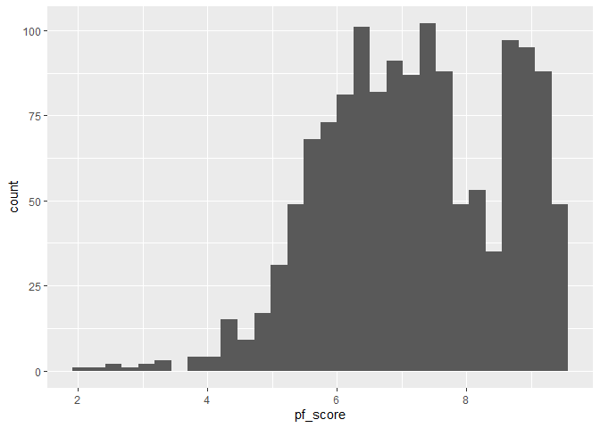
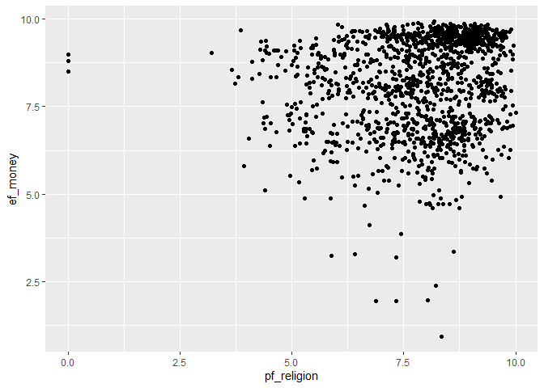

Activity 2 - Day 1
================

## Initial set up of the environment

## Reading in the data

    1. The collection of data is definitely an observational study. They are not forcing these onto different countries.
    2. The pf_score is skewed to the left and there is also a whole in the middle
    3. pf_religion and ef_money does not seem to have much of a relationship. There seems to be a higher proportion of those located around the top right, but no other relationship.

``` r
hfi <- readr::read_csv("https://www.openintro.org/data/csv/hfi.csv")

ggplot(hfi, aes(x = pf_score)) +
  geom_histogram()
```

<!-- -->

``` r
ggplot(hfi, aes(x = pf_religion, y = ef_money)) +
  geom_point()
```

<!-- -->

## Pairwise Relationship

``` r
hfi %>% 
  select(ends_with("_score")) %>% 
  ggpairs()
```

<!-- -->
